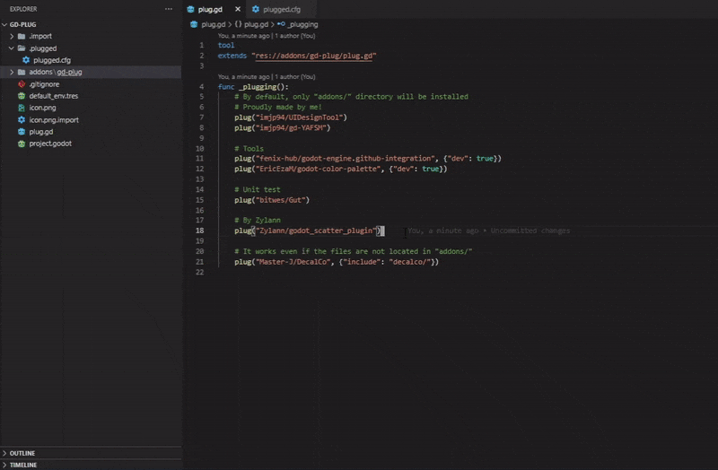

#  gd-plug

Minimal plugin manager for Godot, inspired by [vim-plug](https://github.com/junegunn/vim-plug)



> This version is only compatible with **Godot 4.x**, check out [godot3](https://github.com/imjp94/gd-plug/tree/godot3) branch for older version

## Content

- [Features](#features)
- [Commands](#commands)
- [Configs](#configs)
- [Installation](#installation)
- [Getting Started](#getting-started)
- [Post Update Hook](#post-update-hook)
- [Version Control](#version-control)
- [More Examples](#more-examples)
- [Known Limitations](#known-limitations)

## Features

- Minimal
  - No dependencies other than Godot and git
- Self-contained
  - [One script to run them all](addons/gd-plug/plug.gd)
- Zero learning curve
  - Config file written in GDScript
- Flexible
  - Support both commandline and UI(see [gd-plug-ui](https://github.com/imjp94/gd-plug-ui))
- Blazingly fast
  - Parallel download/installation
- Version freeze
  - Freeze plugins by branch, tag or commit
- Reduce remote repository size
  - Dependencies can now be installed with just a single-line shell command
- Clean uninstall
  - Remove plugin *.import files or import resources from /.import on uninstall

## Commands

```shell
godot --headless -s plug.gd {action} {options...}
```

Actions:

| Action                   | Description                                                                                                                |
| ------------------------ | -------------------------------------------------------------------------------------------------------------------------- |
| `init`                   | Initialize current project by creating `plug.gd` at root                                                                   |
| `status`                 | Check the status of plugins(installed, added or removed), execute this command whenever in doubts                          |
| `install` alias `update` | Install or update(to latest version if not freezed) "plugged" plugins based on `plug.gd`, or uninstall "unplugged" plugins |
| `uninstall`              | Uninstall all plugins, regardless of `plug.gd`                                                                             |
| `clean`                  | Clean unused files/folders from `/.plugged`                                                                                |
| `upgrade`                | Upgrade `addons/gd-plug/plug.gd` to the latest version                                                                     |
| `version`                | Print current version of gd-plug                                                                                           |
| `help`                   | Show help                                                                                                                  |

Options:

| Option                      | Description                                                                                                                                                                                     |
| --------------------------- | ----------------------------------------------------------------------------------------------------------------------------------------------------------------------------------------------- |
| `production`                | Install only plugins not marked as `dev`, or uninstall already installed `dev` plugins                                                                                                          |
| `test`                      | Testing mode, no files will be installed/uninstalled while files to be installed/uninstalled will be printed, mainly used with `install` or `uninstall`                                         |
| `force`                     | Force gd-plug to overwrite destination files when running `install` command. By default, gd-plug will terminate installation of plugin when any of the file found to be overwriting user files. |
| `keep-import-file`          | Keep ".import" files generated by plugin, when run `uninstall` command                                                                                                                          |
| `keep-import-resource-file` | Keep files located in /.import that generated by plugin, when run `uninstall` command                                                                                                           |
| `debug` alias `d`           | Print debug message                                                                                                                                                                             |
| `detail`                    | Print with datetime and log level, "[{time}] [{level}] {msg}"                                                                                                                                   |
| `quiet` alias `q`, `silent` | Disable logging                                                                                                                                                                                 |

## Configs

```gdscript
plug(src, args={})
```

Source:

- Github repo: "username/repo", for example,  "imjp94/gd-plug"

or

- Any valid git url

> [!NOTE]
> To install plugin from private repository, full Git SSH url must be used: `plug("git@github.com:username/repo.git")`. See [Generating new SSH key](https://docs.github.com/en/authentication/connecting-to-github-with-ssh/generating-a-new-ssh-key-and-adding-it-to-the-ssh-agent) and [Adding a new SSH key to your Github account](https://docs.github.com/en/authentication/connecting-to-github-with-ssh/adding-a-new-ssh-key-to-your-github-account)

Arguments:

| Argument     | Type            | Description                                                                                                                                                                                   |
| ------------ | --------------- | --------------------------------------------------------------------------------------------------------------------------------------------------------------------------------------------- |
| `include`    | `Array[String]` | Files or directories to include, only `addons/` will be included if omitted. (No expression like wildcard(*) supported yet.)                                                                  |
| `exclude`    | `Array[String]` | Files or directories to exclude. (No expression like wildcard(*) supported yet.)                                                                                                              |
| `branch`     | `String`        | Name of branch to freeze to                                                                                                                                                                   |
| `tag`        | `String`        | Name of tag to freeze to                                                                                                                                                                      |
| `commit`     | `String`        | Commit hash string to freeze to, must be full length 40 digits commit-hash, for example, `7a642f90d3fb88976dd913051de994e58e838d1a`.                                                          |
| `dev`        | `bool`          | Toggle `dev`  mode. `dev` plugins will not be installed when `install` with `production` option(`dev` plugins will be removed if already installed)                                           |
| `on_updated` | `String`        | Post update hook, a function name declared in `plug.gd` that will be called whenever the plugin installed/updated. See [Post Update Hook](https://github.com/imjp94/gd-plug#post-update-hook) |

## Installation

- gd-plug

  Install directly from Godot Asset Library

  or

  Download this repository, move `addons` to your `{project_dir}`

- git

  Download and install [git](https://git-scm.com/downloads)

  > git must be set to environment variable

- [gd-plug-ui](https://github.com/imjp94/gd-plug-ui)(optional)

  User interface for gd-plug, not required when working with commandline

## Getting Started

1. Create `plug.gd` at your project root, as below:

```gdscript
extends "res://addons/gd-plug/plug.gd"

func _plugging():
    # Declare your plugins in here with plug(src, args)
    pass
```

> [!TIP]
> Or run `init` command: `godot --headless -s addons/gd-plug/plug.gd init`

2. Declare plugins in `plug.gd` under `_plugging()`, for example:

```gdscript
extends "res://addons/gd-plug/plug.gd"

func _plugging():
    # Declare your plugins in here with plug(src, args)
    # By default, only "addons/" directory will be installed
    # Proudly made by me too!
    plug("imjp94/UIDesignTool")
    plug("imjp94/gd-YAFSM")

    # Tools
    plug("fenix-hub/godot-engine.github-integration")
    plug("EricEzaM/godot-color-palette")

    # Unit test
    plug("bitwes/Gut")

    # By Zylann
    plug("Zylann/godot_scatter_plugin")
    plug("Zylann/godot_heightmap_plugin")
```

3. Finally, run `install` command in shell

```shell
# --headless is optional to disable godot window
godot --headless -s plug.gd install 
```

## Post Update Hook

Post update hook can be connected in 3 ways:

- Declare in plug() argument
  - `plug(src, {"on_updated": "post_update"})`
- Connect to `update` signal
  - `connect("updated", self, "post_update")`
- Overwriting `_on_updated` function
  - `func _on_updated(plugin)`

Post update hook always returned with one argument - dictionary that store information about the plugin

```gdscript
func post_update(plugin):
    print("%s updated" % plugin.name)
```

## Version Control

What can be ignored from version control system?

- `/.plugged`: Plugins' git repo are cloned to this directory
- `/addons`: Based on preference, but now dependencies can be safely ignored since it will be managed by gd-plug

What should be added to version control system?

- `plug.gd`: Dependency config file
- `addons/gd-plug/plug.gd`: gd-plug's core

## More Examples

For most of the case, a plugin can be "plugged" without any extra configuration, as by default gd-plug will extract whatever located in plugin's `/addons` directory and install to current project's `/addons` directory.

However, some plugin's repository may be structured differently, thus, different configuration needed.

- Addon files are not located in `/addons` directory, for example, [Master-J/DecalCo](https://github.com/Master-J/DecalCo)
  - Explicitly include the directory to install:

    `plug("Master-J/DecalCo", {"include": ["decalco/"]})`
- Repository contains only addons files, for example, [HungryProton/scatter](https://github.com/HungryProton/scatter/tree/v3)
  - Change `install_root` to destination directory and include all files:
    `plug("HungryProton/scatter", {"install_root": "addons/scatter", "include": ["."]})`

```gdscript
extends "res://addons/gd-plug/plug.gd"

func _plugging():
    # Declare your plugins in here with plug(src, args)
    # By default, only "addons/" directory will be installed
    # Version freeze
    plug("imjp94/UIDesignTool", {"branch": "demo"}) # Always pull update from "demo" branch
    plug("imjp94/gd-YAFSM", {"tag": "1.0.0-stable"}) # Freeze to stable version
    plug("imjp94/gd-plug", {"commit": "7a642f90d3fb88976dd913051de994e58e838d1a"}) # Must be full length 40 digits commit-hash

    # Dev plugins, can be excluded or uninstalled with "production" command
    plug("fenix-hub/godot-engine.github-integration", {"dev": true})
    plug("EricEzaM/godot-color-palette", {"dev": true})

    # Post update hook
    plug("bitwes/Gut", {"on_updated": "_on_GUT_updated"})

    # It works even if the files are not located in "addons/"
    plug("Master-J/DecalCo", {"include": ["decalco/"]})

    # Repo that contains only addon files
    plug("HungryProton/scatter", {"install_root": "addons/scatter", "include": ["."]})

    # Source other than github
    plug("https://gitlab.com/Xecestel/sound-manager") # Gitlab
    plug("file:///D/Godot/local-project/.git") # Local git repo

    connect("updated", "_on_plugin_updated")

func _on_updated(plugin):
    # Override to catch all updated plugins
    match plugin.name:
        "imjp94/gd-plug":
          print("Use upgrade command!")

func _on_GUT_updated(plugin):
    print("%s updated" % plugin.name)
    print("Installed files: " + plugin.dest_files)

func _on_plugin_updated(plugin):
    # Catch all updated plugins with signal
    print("%s post update hook with signal" % plugin.name)
```

## Known Limitations

- Godot always show errors from plugin repositories in `./plugged` even with `.gdignore` (See [#32](https://github.com/imjp94/gd-plug/issues/32))
- Sometimes random .import files will be unable to remove, while the reason behind it still remains unknown.
  - Workaround: Read output for those .import files that failed to remove, and manually delete them.
- `autoload` script references in project setting are not cleared as plugin uninstalled.
  - Workaround: Manually remove `autoload` scripts from project setting
- Binary files in used by Godot can't be removed by gd-plug, when plugin uninstalled with editor opened. For example, [Zylann/godot_heightmap_plugin](https://github.com/Zylann/godot_heightmap_plugin)'s GDNative binaries.
  - Workaround: Quit editor, then execute `clean` command or manually remove plugin folder from `/.plugged`
